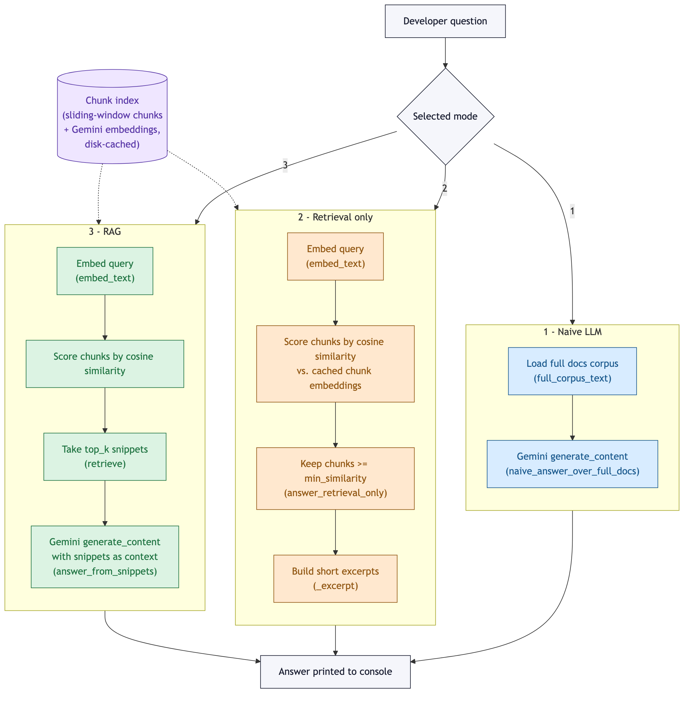
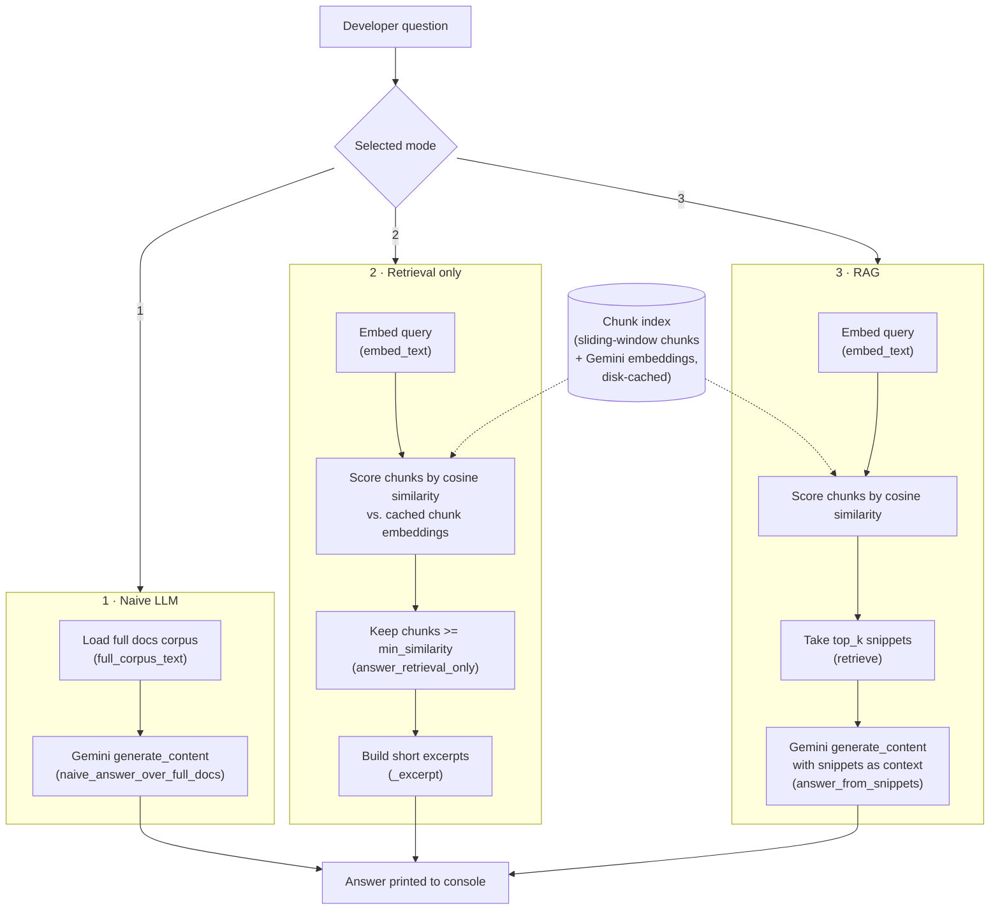

# DocuBot Architecture

DocuBot supports three modes, all starting from the same developer question and
converging on a printed answer. Modes 2 and 3 share a retrieval path (query
embedding → cosine similarity against a pre-built chunk index); mode 3 feeds the
retrieved snippets back into Gemini, while mode 2 stops at the raw excerpts.
Mode 1 skips retrieval entirely and hands the whole corpus to Gemini.

A rendered graphic of this diagram is checked into the repo at
[`images/architecture.png`](images/architecture.png):

Mermaid source

